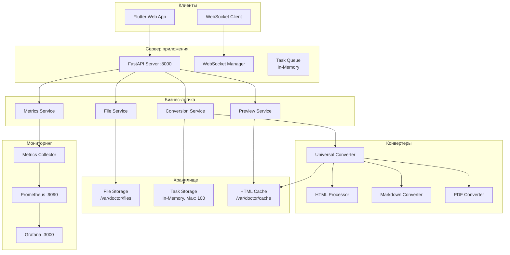
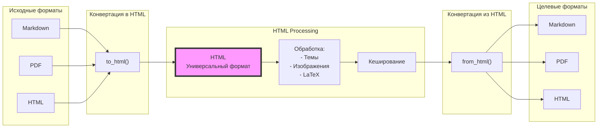
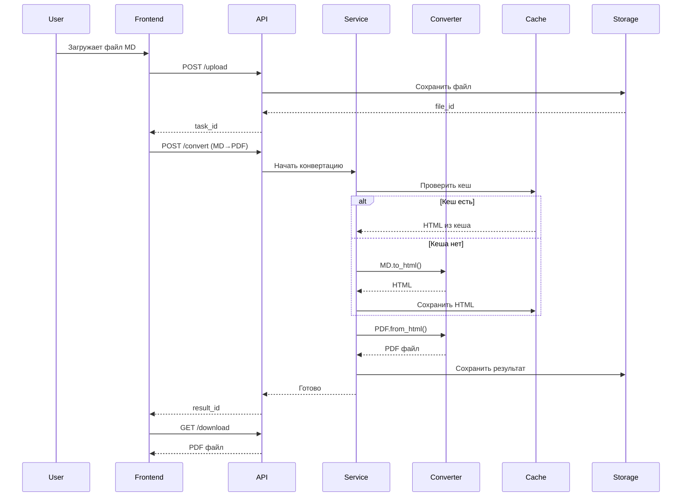
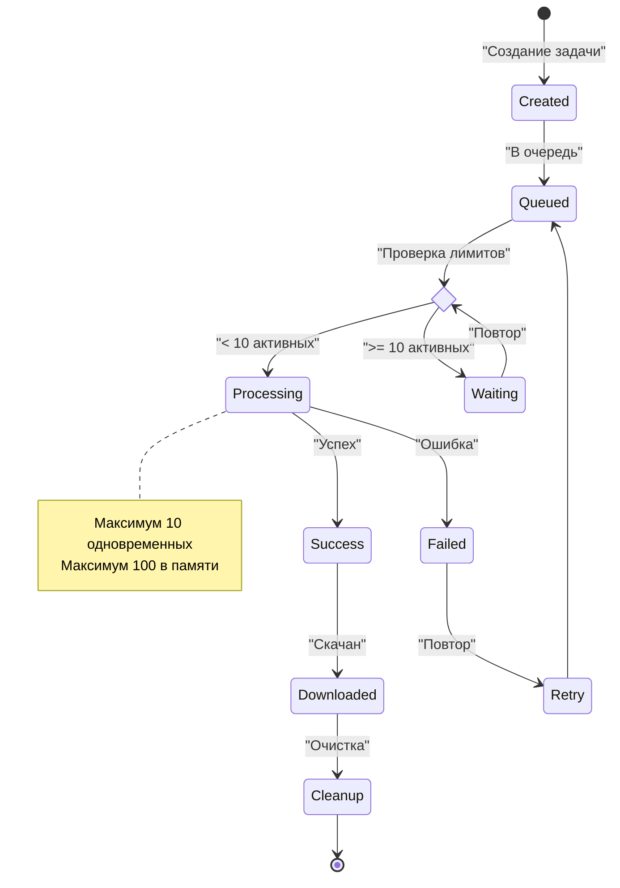

# План разработки Doctor - Сервис конвертации документов

## 1. Описание системы

**Doctor** - веб-сервис для конвертации документов между различными форматами (Markdown, PDF, HTML) с использованием HTML как универсального промежуточного формата.

### Ключевые характеристики:
- **Архитектура**: Один инстанс FastAPI сервера
- **Конвертация**: FORMAT1 → HTML → FORMAT2
- **Ограничения**: 10 одновременных задач, 100 задач в памяти, файлы до 500MB
- **Хранение**: In-memory для задач, файловая система для документов
- **Мониторинг**: Prometheus + Grafana

## 2. Архитектура системы

### 2.1. Общая схема компонентов



### 2.2. Архитектура конвертации через HTML



## 3. Структура проекта

### 3.1. Backend структура

```
backend/
├── app/
│   ├── api/
│   │   ├── endpoints/
│   │   │   ├── upload.py
│   │   │   ├── convert.py
│   │   │   ├── preview.py
│   │   │   ├── download.py
│   │   │   └── metrics.py
│   │   └── websocket/
│   │       └── status.py
│   ├── core/
│   │   ├── config.py
│   │   ├── exceptions.py
│   │   └── logging.py
│   ├── services/
│   │   ├── conversion_service.py
│   │   ├── file_service.py
│   │   ├── preview_service.py
│   │   ├── task_service.py
│   │   └── metrics_service.py
│   ├── converters/
│   │   ├── base.py
│   │   ├── markdown.py
│   │   ├── pdf.py
│   │   ├── universal.py
│   │   └── processors/
│   │       ├── html_processor.py
│   │       ├── image_processor.py
│   │       └── latex_processor.py
│   ├── models/
│   │   ├── task.py
│   │   ├── file.py
│   │   └── conversion.py
│   ├── storage/
│   │   ├── file_storage.py
│   │   ├── task_storage.py
│   │   └── html_cache.py
│   └── utils/
│       ├── validators.py
│       └── encoding.py
├── tests/
├── scripts/
│   ├── install.py
│   ├── start.py
│   └── stop.py
├── requirements.txt
├── .env
└── main.py
```

### 3.2. Frontend структура

```
frontend/
├── lib/
│   ├── core/
│   │   ├── api/
│   │   │   ├── api_client.dart
│   │   │   └── websocket_client.dart
│   │   ├── models/
│   │   │   ├── task.dart
│   │   │   ├── file.dart
│   │   │   └── conversion_config.dart
│   │   └── services/
│   │       ├── upload_service.dart
│   │       ├── conversion_service.dart
│   │       └── preview_service.dart
│   ├── features/
│   │   ├── upload/
│   │   ├── conversion/
│   │   ├── preview/
│   │   └── dashboard/
│   ├── shared/
│   │   ├── widgets/
│   │   └── themes/
│   └── main.dart
├── web/
├── test/
└── pubspec.yaml
```

## 4. Workflow процессов

### 4.1. Процесс конвертации



### 4.2. Управление задачами



## 5. План разработки по модулям

### Модуль A: Базовая инфраструктура
- **A.1. Настройка проекта**
  - Структура директорий
  - Конфигурация FastAPI
  - Настройка логирования
  - Файл .env

- **A.2. Модели данных**
  - Pydantic модели (Task, File, Config)
  - Enum для статусов и форматов
  - Валидаторы

- **A.3. Хранилища**
  - TaskStorage (in-memory dict с лимитами)
  - FileStorage (файловая система)
  - HTMLCache (файловый кеш)

### Модуль B: API Endpoints
- **B.1. Upload**
  - POST /upload/file
  - POST /upload/text
  - POST /upload/url
  - Валидация размера и формата

- **B.2. Conversion**
  - POST /convert
  - GET /formats
  - GET /status/{task_id}

- **B.3. Results**
  - GET /preview/{file_id}
  - GET /download/{file_id}
  - DELETE /file/{file_id}

### Модуль C: Система конвертации
- **C.1. Базовая архитектура**
  - BaseConverter (абстрактный класс)
  - UniversalConverter (управление pipeline)
  - HTMLProcessor (обработка HTML)

- **C.2. Markdown конвертер**
  - to_html: парсинг MD, Mermaid, LaTeX, код
  - from_html: генерация MD из HTML

- **C.3. PDF конвертер**
  - to_html: извлечение текста и изображений
  - from_html: генерация PDF через wkhtmltopdf

- **C.4. Процессоры**
  - ImageProcessor (обработка изображений)
  - LatexProcessor (рендеринг формул)

### Модуль D: Сервисы
- **D.1. ConversionService**
  - Управление процессом конвертации
  - Работа с кешем
  - Контроль лимитов

- **D.2. FileService**
  - Сохранение/загрузка файлов
  - Валидация
  - Очистка старых файлов

- **D.3. TaskService**
  - Управление очередью задач
  - Контроль лимитов (10/100)
  - Очистка завершенных

- **D.4. PreviewService**
  - Генерация preview
  - Кеширование preview

### Модуль E: WebSocket
- **E.1. WebSocket Manager**
  - Управление соединениями
  - Отправка обновлений статуса

- **E.2. Real-time обновления**
  - Прогресс конвертации
  - Уведомления об ошибках

### Модуль F: Frontend основа
- **F.1. Архитектура**
  - Flutter Web setup
  - BLoC pattern
  - Роутинг

- **F.2. API клиент**
  - HTTP клиент (dio)
  - WebSocket клиент
  - Обработка ошибок

### Модуль G: Frontend функциональность
- **G.1. Upload**
  - Drag & drop
  - Выбор файла
  - URL загрузка
  - Текстовый ввод

- **G.2. Конвертация**
  - Выбор формата
  - Настройки (тема, стили)
  - Отображение прогресса

- **G.3. Preview и Download**
  - Просмотр результата
  - Скачивание файла

### Модуль H: Мониторинг
- **H.1. Метрики**
  - Сбор метрик (время, размеры, ошибки)
  - Экспорт в Prometheus

- **H.2. Dashboard**
  - Frontend дашборд
  - Grafana настройка

### Модуль I: Тестирование
- **I.1. Backend тесты**
  - Unit тесты конвертеров
  - API тесты
  - Тесты производительности

- **I.2. Frontend тесты**
  - Widget тесты
  - Integration тесты

### Модуль J: Развертывание
- **J.1. Скрипты**
  - install.py (зависимости)
  - start.py (запуск сервисов)
  - stop.py (остановка)

## 6. Приоритизация разработки

### Фаза 1: MVP (2 недели)
1. Модуль A: Инфраструктура
2. Модуль B.1: Upload API
3. Модуль C.1-C.2: Базовые конвертеры (MD↔HTML)
4. Модуль F: Frontend основа
5. Модуль G.1: Upload UI

### Фаза 2: Полная функциональность (3 недели)
1. Модуль C.3-C.4: Все конвертеры
2. Модуль D: Все сервисы
3. Модуль E: WebSocket
4. Модуль G.2-G.3: Полный UI
5. Модуль B.2-B.3: Все API

### Фаза 3: Продакшн (1 неделя)
1. Модуль H: Мониторинг
2. Модуль I: Тестирование
3. Модуль J: Развертывание
4. Оптимизация

## 7. Технический стек

### Backend
- **Framework**: FastAPI + Uvicorn
- **Конвертеры**:
  - Markdown: python-markdown, pymdown-extensions
  - PDF: pdfplumber, wkhtmltopdf
  - Изображения: Pillow
  - LaTeX: KaTeX
- **Хранение**: In-memory + файловая система
- **Мониторинг**: prometheus-client

### Frontend
- **Framework**: Flutter Web
- **State**: flutter_bloc
- **HTTP**: dio
- **WebSocket**: web_socket_channel
- **UI**: Material Design

### Инфраструктура
- **OS**: Linux (Ubuntu/Debian)
- **Python**: 3.10+
- **Мониторинг**: Prometheus + Grafana
- **Логи**: Файловая система с ротацией

## 8. Конфигурация системы

### 8.1. Переменные окружения (.env)

```env
# Server
APP_PORT=8000
APP_ENV=production

# Storage
UPLOAD_DIR=/var/doctor/uploads
TEMP_DIR=/var/doctor/temp
CACHE_DIR=/var/doctor/cache
MAX_FILE_SIZE=524288000  # 500MB

# Limits
MAX_CONCURRENT_TASKS=10
MAX_TASKS_IN_MEMORY=100
TASK_TIMEOUT=300
CACHE_SIZE=50

# Monitoring
PROMETHEUS_PORT=9090
GRAFANA_PORT=3000
LOG_LEVEL=INFO
```

### 8.2. Системные требования

- **CPU**: 2+ cores
- **RAM**: 2GB минимум
- **Disk**: 10GB для файлов
- **OS**: Linux с поддержкой Python 3.10+

## 9. API примеры

### 9.1. Загрузка и конвертация

```python
# 1. Загрузка файла
POST /api/upload/file
Content-Type: multipart/form-data
Body: file=document.md

Response:
{
    "task_id": "task_123",
    "file_id": "file_456",
    "format": "markdown"
}

# 2. Конвертация
POST /api/convert
{
    "file_id": "file_456",
    "source": "markdown",
    "target": "pdf",
    "options": {
        "theme": "github",
        "code_style": "monokai"
    }
}

Response:
{
    "task_id": "task_123",
    "status": "processing"
}

# 3. WebSocket подключение
WS /ws/status/task_123
→ {"status": "processing", "progress": 50}
→ {"status": "completed", "result_id": "result_789"}

# 4. Скачивание
GET /api/download/result_789
→ Binary PDF content
```

### 9.2. Работа с кешем

```python
# Повторная конвертация из кеша
POST /api/convert
{
    "file_id": "file_456",  # Тот же файл
    "source": "markdown",
    "target": "html"  # Другой формат
}
# HTML уже в кеше, конвертация быстрая
```

## 10. Реализация ключевых компонентов

### 10.1. UniversalConverter

```python
class UniversalConverter:
    def __init__(self):
        self.converters = {
            'markdown': MarkdownConverter(),
            'pdf': PDFConverter()
        }
        self.processor = HTMLProcessor()
        self.cache = HTMLCache('/var/doctor/cache')
    
    def convert(self, source: str, target: str, data: bytes) -> bytes:
        # Проверка кеша
        cache_key = self._hash(data)
        html = self.cache.get(cache_key)
        
        if not html:
            # Конвертация в HTML
            converter = self.converters[source]
            html = converter.to_html(data)
            html = self.processor.normalize(html)
            self.cache.set(cache_key, html)
        
        # Конвертация из HTML
        if target == 'html':
            return html.encode()
        
        converter = self.converters[target]
        return converter.from_html(html)
```

### 10.2. TaskStorage

```python
class TaskStorage:
    def __init__(self, max_size=100, max_active=10):
        self.tasks = {}
        self.max_size = max_size
        self.max_active = max_active
        self.lock = asyncio.Lock()
    
    async def add_task(self, task: Task) -> bool:
        async with self.lock:
            # Проверка лимитов
            if len(self.tasks) >= self.max_size:
                self._cleanup_old()
            
            active = self._count_active()
            if active >= self.max_active:
                task.status = TaskStatus.WAITING
            else:
                task.status = TaskStatus.PROCESSING
            
            self.tasks[task.id] = task
            return True
    
    def _count_active(self) -> int:
        return sum(1 for t in self.tasks.values() 
                  if t.status == TaskStatus.PROCESSING)
```

## 11. Критические точки

### Производительность
- Асинхронная обработка всех IO операций
- Кеширование HTML промежуточных результатов
- Ограничение одновременных задач (10)
- Streaming для больших файлов

### Надежность
- Валидация входных данных
- Обработка всех исключений
- Автоматическая очистка старых файлов
- Graceful shutdown

### Безопасность
- Валидация типов файлов
- Ограничение размера (500MB)
- Изоляция временных файлов
- Санитизация HTML

### Масштабируемость
- Готовность к добавлению новых форматов
- Модульная архитектура
- Возможность будущего масштабирования

## 12. Метрики успеха

- ✅ Конвертация между всеми форматами работает
- ✅ Время конвертации < 5 минут для 500MB
- ✅ Поддержка изображений и LaTeX
- ✅ Корректная работа с кириллицей
- ✅ Автоматическая очистка ресурсов
- ✅ Мониторинг всех операций
- ✅ 95%+ успешных конвертаций