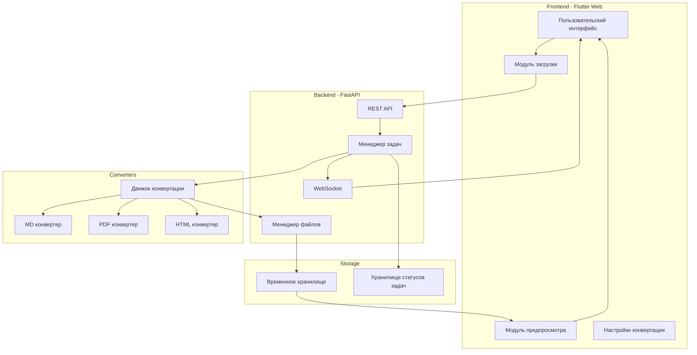

# Техническое задание - Doctor
## Сервис конвертации документов

### 1. Общее описание проекта

**Название:** Doctor  
**Тип:** Веб-приложение для конвертации документов  
**Версия:** MVP 1.0  
**Цель:** Создать веб-сервис для конвертации документов между различными форматами

### 2. Основные требования

- **Поддерживаемые форматы:** Markdown, PDF, HTML
- **Максимальный размер файла:** 500 МБ
- **Одновременные конвертации:** до 10
- **Способы загрузки:** drag & drop, выбор файла, URL, вставка текста
- **Предпросмотр:** обязателен перед скачиванием
- **Настройки:** выбор темы и цветовой схемы для кода
- **Хранение:** временное, удаление после скачивания
- **Обработка:** асинхронная

### 3. Архитектура системы (схема)

### 4. Последовательность действий

## 4.1. Процесс загрузки файла

### Шаг 1: Инициализация загрузки
**Входные данные:**
- Файл или текст для конвертации
- Способ загрузки (drag & drop, файл, URL, текст)

**Назначение:**
Валидация и подготовка файла к загрузке на сервер

**Что нужно сделать:**
1. Проверить размер файла (не более 500 МБ)
2. Проверить формат файла (md, pdf, html)
3. Отобразить индикатор загрузки
4. Сгенерировать уникальный идентификатор задачи

**Выходные артефакты:**
- Валидированный файл
- Уникальный task_id

### Шаг 2: Передача на сервер
**Входные данные:**
- Валидированный файл
- task_id

**Назначение:**
Загрузка файла на сервер для последующей обработки

**Что нужно сделать:**
1. Отправить файл через API endpoint
2. Сохранить файл во временное хранилище
3. Создать запись о задаче в менеджере задач
4. Вернуть подтверждение загрузки

**Выходные артефакты:**
- file_id загруженного файла
- Подтверждение успешной загрузки

## 4.2. Конфигурация конвертации

### Шаг 3: Выбор параметров конвертации
**Входные данные:**
- file_id загруженного файла
- Исходный формат файла

**Назначение:**
Настройка параметров конвертации документа

**Что нужно сделать:**
1. Определить доступные форматы для конвертации
2. Предоставить выбор целевого формата
3. Предоставить выбор темы оформления
4. Предоставить выбор цветовой схемы для кода

**Выходные артефакты:**
- Конфигурация конвертации (целевой формат, тема, стиль кода)

## 4.3. Процесс конвертации

### Шаг 4: Запуск конвертации
**Входные данные:**
- file_id
- Конфигурация конвертации

**Назначение:**
Запуск асинхронного процесса конвертации документа

**Что нужно сделать:**
1. Создать задачу конвертации
2. Запустить асинхронный процесс
3. Установить WebSocket соединение для отслеживания прогресса
4. Обновлять статус задачи в реальном времени

**Выходные артефакты:**
- Активная задача конвертации
- WebSocket канал для обновлений

### Шаг 5: Выполнение конвертации
**Входные данные:**
- Исходный файл
- Параметры конвертации

**Назначение:**
Непосредственная конвертация документа в целевой формат

**Что нужно сделать:**
1. Загрузить соответствующий конвертер
2. Применить выбранные настройки
3. Выполнить конвертацию
4. Сохранить результат во временное хранилище
5. Обновить статус задачи

**Выходные артефакты:**
- Сконвертированный файл
- Обновленный статус задачи

## 4.4. Предпросмотр и скачивание

### Шаг 6: Генерация предпросмотра
**Входные данные:**
- Сконвертированный файл
- Формат файла

**Назначение:**
Создание предварительного просмотра результата конвертации

**Что нужно сделать:**
1. Сгенерировать preview в зависимости от формата
2. Оптимизировать для отображения в браузере
3. Кешировать preview для быстрого доступа

**Выходные артефакты:**
- URL для предпросмотра
- Кешированный preview

### Шаг 7: Отображение предпросмотра
**Входные данные:**
- URL предпросмотра

**Назначение:**
Показать пользователю результат конвертации перед скачиванием

**Что нужно сделать:**
1. Загрузить preview в интерфейс
2. Предоставить возможность масштабирования
3. Показать кнопки для скачивания или повторной конвертации

**Выходные артефакты:**
- Отображенный preview
- Пользовательское решение (скачать/переделать)

### Шаг 8: Скачивание файла
**Входные данные:**
- file_id результата
- Подтверждение от пользователя

**Назначение:**
Предоставление готового файла для скачивания

**Что нужно сделать:**
1. Подготовить файл для скачивания
2. Установить правильные HTTP заголовки
3. Инициировать скачивание
4. Запустить процесс очистки

**Выходные артефакты:**
- Скачанный файл у пользователя

## 4.5. Очистка ресурсов

### Шаг 9: Удаление временных файлов
**Входные данные:**
- file_id исходного файла
- file_id результата
- task_id

**Назначение:**
Освобождение дискового пространства после завершения работы

**Что нужно сделать:**
1. Удалить исходный файл из временного хранилища
2. Удалить сконвертированный файл
3. Удалить кешированный preview
4. Очистить запись о задаче из памяти

**Выходные артефакты:**
- Освобожденное дисковое пространство
- Очищенная память

### 5. API Endpoints

#### Загрузка файлов
- `POST /api/upload/file` - загрузка файла
- `POST /api/upload/text` - загрузка текста
- `POST /api/upload/url` - загрузка по URL
- `GET /api/upload/status/{task_id}` - статус загрузки

#### Конвертация
- `POST /api/convert/` - запуск конвертации
- `GET /api/convert/formats` - доступные форматы
- `GET /api/convert/themes` - доступные темы
- `GET /api/convert/status/{task_id}` - статус конвертации

#### Результаты
- `GET /api/preview/{file_id}` - предпросмотр
- `GET /api/download/{file_id}` - скачивание

#### WebSocket
- `WS /ws/status/{task_id}` - real-time обновления статуса

### 6. Требования к реализации

#### Backend (FastAPI)
- Асинхронная обработка запросов
- Background tasks для конвертации
- In-memory хранилище для статусов задач
- WebSocket для real-time обновлений
- Валидация входных данных
- Обработка ошибок

#### Frontend (Flutter Web)
- Drag & drop интерфейс
- Множественные способы загрузки
- Индикаторы прогресса
- Предпросмотр результатов
- Адаптивный дизайн
- WebSocket клиент

#### Конвертеры
- Плагинная архитектура
- Базовый класс для всех конвертеров
- Поддержка тем оформления
- Поддержка подсветки синтаксиса
- Обработка Mermaid диаграмм (для Markdown)

### 7. Ограничения MVP

- Без авторизации пользователей
- Без истории конвертаций
- Без пакетной обработки
- Локальное развертывание
- Максимум 10 одновременных задач
- Максимум 100 задач в памяти

### 8. Критерии успеха

- Успешная конвертация между всеми заявленными форматами
- Время конвертации не более 5 минут
- Корректный предпросмотр результатов
- Стабильная работа при заявленной нагрузке
- Автоматическая очистка временных файлов

### 9. Развертывание

- Python скрипты для установки зависимостей
- Python скрипты для запуска/остановки сервисов
- Конфигурация через .env файлы
- Логирование в файлы
- Health check endpoints
