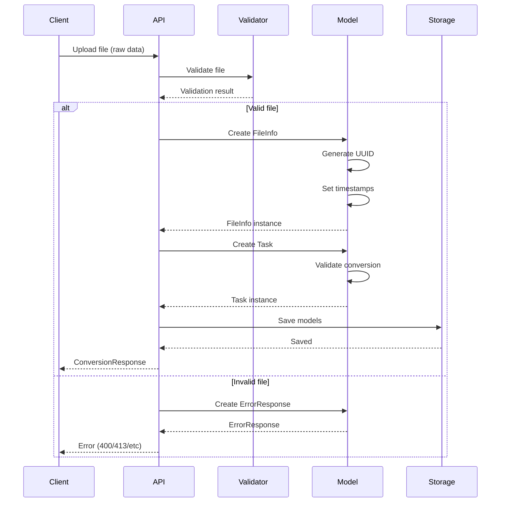
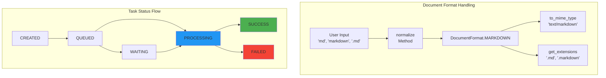
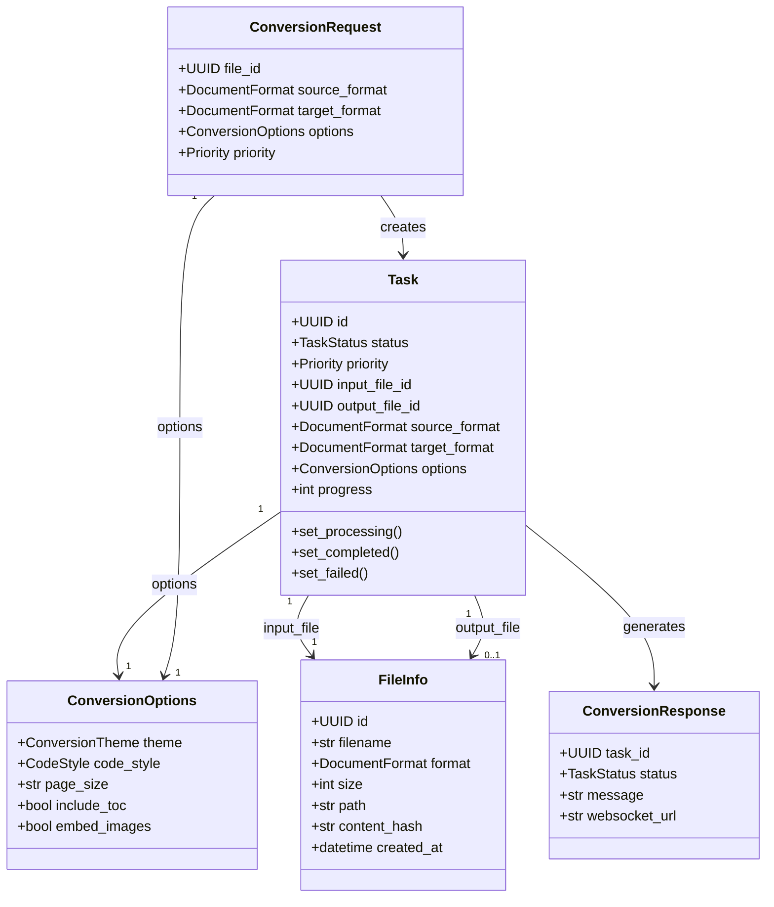
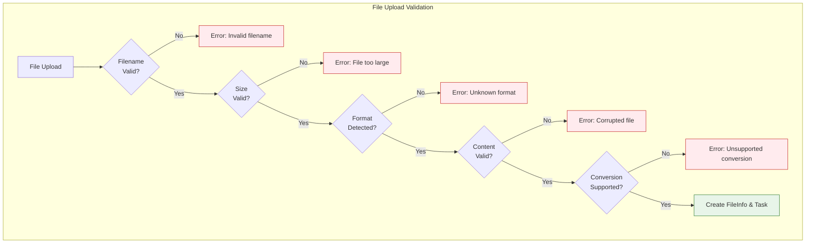
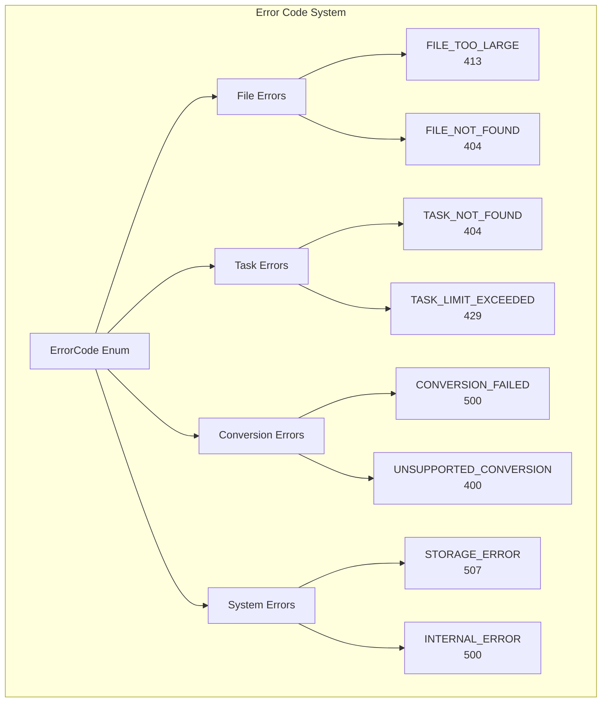

# Module A.2: Data Models - Documentation

## Overview
Модуль A.2 определяет все модели данных для системы Doctor, включая Pydantic модели, перечисления (Enums) и валидаторы. Это основа для типизации данных и валидации во всей системе.

## Component Architecture

```mermaid
graph TB
    subgraph "Module A.2 - Data Models"
        style "Module A.2 - Data Models" fill:#e1f5fe,stroke:#01579b,stroke-width:3px
        
        subgraph "Enums & Constants"
            DF[DocumentFormat]
            TS[TaskStatus]
            CT[ConversionTheme]
            CS[CodeStyle]
            EC[ErrorCode]
            CONST[Constants]
        end
        
        subgraph "Core Models"
            FI[FileInfo]
            TASK[Task]
            CO[ConversionOptions]
            STATS[TaskStats]
        end
        
        subgraph "API Models"
            CR[ConversionRequest]
            CRESP[ConversionResponse]
            ER[ErrorResponse]
        end
        
        subgraph "Validators"
            FV[FileValidator]
            UV[URLValidator]
            TV[TextValidator]
            CV[ConversionValidator]
        end
    end
    
    DF --> FI
    DF --> TASK
    TS --> TASK
    CT --> CO
    CS --> CO
    CO --> TASK
    EC --> ER
    
    FV --> FI
    CV --> CR
    
    style DF fill:#ffeb3b,stroke:#f57c00
    style TASK fill:#4caf50,stroke:#1b5e20
    style FV fill:#ff9800,stroke:#e65100
```

## Module Integration

```mermaid
graph LR
    subgraph "Previous"
        A1[A.1 Project Setup<br/>✅ COMPLETED]
    end
    
    subgraph "Current Module"
        style "Current Module" fill:#fff3e0,stroke:#e65100,stroke-width:3px
        A2[A.2 Data Models<br/>✅ CURRENT]
    end
    
    subgraph "Next Modules"
        A3[A.3 Storage]
        B1[B.1 Upload API]
        C1[C.1 Converters]
    end
    
    subgraph "Dependencies"
        PYD[Pydantic]
        MAG[python-magic]
    end
    
    A1 --> A2
    PYD --> A2
    MAG --> A2
    
    A2 --> A3
    A2 --> B1
    A2 --> C1
    
    style A2 fill:#4caf50,stroke:#1b5e20,stroke-width:3px
    style A3 fill:#e0e0e0
    style B1 fill:#e0e0e0
```

## Data Flow



## Enum System



## Model Relationships



## Validation Pipeline



## Key Components

### 1. Enumerations (enums.py)

**DocumentFormat**
- Поддерживаемые форматы: MARKDOWN, PDF, HTML
- Методы нормализации для гибкого ввода
- Маппинг расширений и MIME типов

**TaskStatus**
- Жизненный цикл задачи: CREATED → QUEUED → PROCESSING → SUCCESS/FAILED
- Свойства для проверки состояния (is_final, is_active, can_cancel)

**Constants**
- Системные лимиты (MAX_FILE_SIZE: 500MB)
- Матрица конвертации
- Пути к директориям

### 2. Core Models (models.py)

**FileInfo**
- Полная информация о файле
- UUID идентификатор
- Хеш содержимого для кеширования
- Timestamps для отслеживания

**Task**
- Центральная модель для операций конвертации
- Отслеживание прогресса (0-100%)
- Связь с входным и выходным файлами
- Методы жизненного цикла

**ConversionOptions**
- Настройки конвертации
- Темы оформления
- Стили подсветки кода
- Параметры PDF

### 3. Validators (validators.py)

**FileValidator**
- Проверка размера файла (с учетом источника)
- Валидация имени файла (безопасность)
- Определение формата через magic bytes
- Проверка содержимого

**URLValidator**
- Проверка схемы (http/https)
- Блокировка локальных адресов
- Проверка приватных IP

**TextValidator**
- Валидация текстового ввода
- Проверка синтаксиса HTML/Markdown
- Защита от XSS

**ConversionValidator**
- Проверка поддержки конвертации
- Валидация опций конвертации

## Usage Examples

### Creating a Task

```python
from app.models import Task, FileInfo, ConversionOptions
from app.models.enums import DocumentFormat, ConversionTheme

# Create file info
file = FileInfo(
    filename="report.md",
    format=DocumentFormat.MARKDOWN,
    size=1024000,
    path="uploads/2024/report.md",
    content_hash="sha256:abc123",
    mime_type="text/markdown"
)

# Create task with options
task = Task(
    input_file_id=file.id,
    source_format=DocumentFormat.MARKDOWN,
    target_format=DocumentFormat.PDF,
    options=ConversionOptions(
        theme=ConversionTheme.GITHUB,
        include_toc=True
    )
)

# Process task
task.set_processing()
# ... conversion logic ...
task.set_completed(output_file_id)
```

### Validation Flow

```python
from app.models.validators import FileValidator, ConversionValidator

# Validate file
is_valid, error = FileValidator.validate_filename("document.md")
if not is_valid:
    raise ValueError(error)

# Validate conversion
is_valid, error = ConversionValidator.validate_conversion(
    DocumentFormat.MARKDOWN,
    DocumentFormat.PDF
)
if not is_valid:
    raise ValueError(error)
```

## Error Handling



## Pydantic Features Used

### Validation
- **Field validators** - для кастомной валидации
- **AfterValidator** - для пост-обработки
- **ConfigDict** - для конфигурации моделей

### Serialization
- **model_dump()** - в словарь Python
- **model_dump_json()** - в JSON строку
- **model_validate()** - из словаря
- **model_validate_json()** - из JSON

### Schema
- **JSON Schema** - автоматическая генерация
- **Field descriptions** - документация полей
- **Examples** - примеры в схеме

## Demo Script Features

`demo_models.py` демонстрирует:

1. **Enum функциональность**
   - Нормализация форматов
   - Маппинг расширений
   - Проверка конвертации

2. **Создание моделей**
   - FileInfo с валидацией
   - Task с жизненным циклом
   - ConversionOptions

3. **Валидация**
   - Проверка имен файлов
   - Валидация размеров
   - URL проверки

4. **Сериализация**
   - В JSON и обратно
   - Генерация схемы

5. **Real-world сценарий**
   - Полный процесс конвертации
   - От загрузки до результата

## Files Created/Modified

### Created Files:
- `/backend/app/models/enums.py` - перечисления и константы
- `/backend/app/models/models.py` - основные модели данных
- `/backend/app/models/validators.py` - валидаторы
- `/demo_models.py` - демонстрационный скрипт
- `/Module_A2_Models_Documentation.md` - эта документация

### Structure:
```
backend/app/models/
├── __init__.py
├── enums.py        # 250+ lines
├── models.py       # 400+ lines
└── validators.py   # 350+ lines
```

## Integration Points

### With Module A.3 (Storage)
- Модели готовы для сохранения в хранилища
- UUID идентификаторы для связей
- Timestamps для отслеживания

### With Module B.1 (Upload API)
- Request/Response модели для endpoints
- Валидаторы для проверки входных данных
- ErrorResponse для обработки ошибок

### With Module C (Converters)
- DocumentFormat для определения конвертеров
- ConversionOptions для настроек
- Task для отслеживания процесса

## Success Metrics

✅ **Выполнено**:
- Полная система Enum с 7+ перечислениями
- 10+ Pydantic моделей с валидацией
- 4 класса валидаторов с 15+ методами
- Поддержка всех форматов (MD, PDF, HTML)
- Полная типизация с type hints
- JSON сериализация/десериализация
- Автоматическая генерация схем
- Обработка ошибок с HTTP кодами

## Next Steps

После завершения Module A.2:

1. **Module A.3**: Реализация хранилищ с использованием моделей
2. **Module B.1**: Создание API endpoints с моделями запросов/ответов
3. **Module C.1**: Использование моделей в конвертерах

## Summary

Module A.2 успешно создает полную систему моделей данных:
- ✅ Типизированные модели с Pydantic
- ✅ Валидация на всех уровнях
- ✅ Гибкая система Enum
- ✅ Поддержка сериализации
- ✅ Готовность к интеграции с API и хранилищами

Система моделей готова к использованию в следующих модулях проекта Doctor.