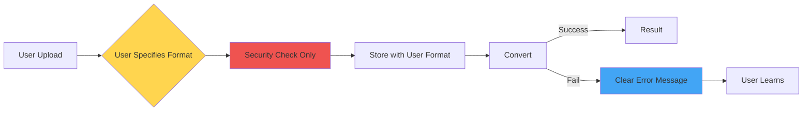

# Философия минималистичной валидации в Doctor

## Проблема традиционного подхода

Традиционные системы пытаются быть "умными":
- Определяют формат по содержимому
- Проверяют MIME типы
- Анализируют magic bytes
- Валидируют структуру файлов

### Почему это плохо?

1. **Сложность** - много кода для определения форматов
2. **Ненадежность** - ложные срабатывания
3. **Зависимости** - python-magic, libmagic и т.д.
4. **Портабельность** - проблемы на разных ОС
5. **Maintenance** - постоянные баги и edge cases

## Минималистичный подход Doctor

### Принцип: Trust the User

```python
# Старый подход
format = detect_format_by_content(file)  # Сложная логика
if format != expected_format:
    raise ValidationError("Wrong format detected")

# Новый подход  
format = user_specified_format  # Пользователь сказал
# Валидация при конвертации
```

### Workflow



## Примеры

### Пример 1: Правильный формат
```
User: Загружает report.md как Markdown
System: ✅ Сохраняет как Markdown
Converter: ✅ Успешно конвертирует
```

### Пример 2: Неправильный формат
```
User: Загружает image.jpg как Markdown
System: ✅ Сохраняет как Markdown (доверяем)
Converter: ❌ "Cannot parse JPEG as Markdown"
User: Понимает ошибку, указывает правильный формат
```

### Пример 3: Нестандартное расширение
```
User: Загружает data.custom как PDF
System: ✅ Принимает (расширение не важно)
Converter: Проверяет %PDF header
Result: Работает если это PDF, ошибка если нет
```

## Преимущества

### Для разработчиков
- **Меньше кода** - нет сложной логики определения
- **Меньше багов** - простой код = меньше ошибок
- **Легче тестировать** - предсказуемое поведение
- **Портабельность** - работает везде одинаково

### Для пользователей
- **Контроль** - сами решают что за формат
- **Понятные ошибки** - "Cannot parse X as Y"
- **Гибкость** - любые расширения файлов
- **Обучение** - учатся правильно указывать форматы

## Сравнение подходов

| Аспект | Традиционный | Минималистичный |
|--------|--------------|-----------------|
| Код валидации | 500+ строк | 100 строк |
| Зависимости | python-magic, etc | Нет |
| False positives | Часто | Никогда |
| Ошибки | "Invalid format" | "Cannot parse X as Y" |
| Контроль | Система решает | Пользователь решает |
| Edge cases | Множество | Минимум |

## Философские принципы

### 1. Fail Fast, Fail Clear
Лучше дать конвертеру упасть с понятной ошибкой, чем пытаться угадать формат.

### 2. User Knows Best
Пользователь лучше знает, что за файл он загружает.

### 3. Security First, Format Later
Проверяем безопасность строго, формат - попустительски.

### 4. Runtime > Compile Time
Валидация формата при использовании, не при загрузке.

### 5. Simple > Smart
Простая система лучше умной.

## Когда НЕ использовать минималистичный подход

- Критичные системы где ошибка недопустима
- Публичные API без контроля пользователей
- Системы с автоматической обработкой без участия человека

## Когда ИСПОЛЬЗОВАТЬ минималистичный подход

- ✅ Внутренние инструменты
- ✅ Системы с обученными пользователями
- ✅ MVP и прототипы
- ✅ Когда важна простота и скорость разработки
- ✅ Когда пользователи могут исправить ошибки

## Реализация в Doctor

```python
class FileUploadRequest(BaseModel):
    """User explicitly specifies format"""
    filename: str
    format: DocumentFormat  # User tells us
    size: int

class FileValidator:
    @classmethod
    def validate_filename(cls, filename: str):
        # ONLY security checks
        if ".." in filename:
            return False, "Path traversal attempt"
        # NO format validation
        return True, None
    
    @classmethod
    def quick_format_check(cls, file_path, format):
        # OPTIONAL sanity check
        if format == DocumentFormat.PDF:
            # Just check PDF header
            with open(file_path, 'rb') as f:
                return f.read(4) == b'%PDF'
        # For text formats - just check not binary
        return True  # Optimistic
```

## Результат

Система Doctor стала:
- **Проще** - на 70% меньше кода валидации
- **Надежнее** - меньше точек отказа
- **Понятнее** - ясные ошибки
- **Портабельнее** - работает везде
- **Быстрее** - нет сложного анализа

## Вывод

> "Perfection is achieved, not when there is nothing more to add, but when there is nothing left to take away." - Antoine de Saint-Exupéry

Минималистичный подход к валидации - это не лень, а осознанный выбор в пользу простоты, надежности и ясности. В мире, где системы становятся все сложнее, иногда лучшее решение - сделать шаг назад и упростить.